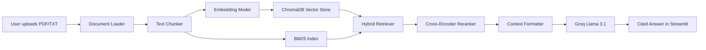

# AI Research Assistant - Advanced RAG Chatbot

[](https://www.python.org/)
[](https://streamlit.io/)
[](https://www.langchain.com/)
[](https://www.trychroma.com/)
[](https://groq.com/)
[](LICENSE)

A production-style document question-answering assistant built with Retrieval-Augmented Generation (RAG). The app lets users upload PDFs or text files, indexes them into a vector database, retrieves relevant evidence with hybrid search, reranks results, and generates grounded answers with source citations.

> Built by Umar Asghar as a portfolio-grade AI engineering project.

## Live Links

- GitHub: https://github.com/Umarkahout14/rag-chatbot
- Live Demo: https://rag-chatbot-zqegvptq364a279zhgdxeh.streamlit.app

## What This Project Demonstrates

- End-to-end RAG architecture from document ingestion to cited answer generation
- PDF/TXT loading, chunking, embedding, vector storage, retrieval, reranking, and LLM response generation
- Hybrid retrieval using dense vector search plus BM25 keyword search
- Cross-encoder reranking for improved relevance
- Conversation memory for multi-turn interaction
- Secure deployment using Streamlit Secrets and environment variables
- Professional Streamlit UI with upload workflow, chat interface, and source previews

## Feature Overview

| Area | Implementation |
|---|---|
| Frontend | Streamlit professional UI |
| LLM | Groq API with Llama 3.1 |
| Embeddings | sentence-transformers/all-MiniLM-L6-v2 |
| Vector Store | ChromaDB persistent database |
| Retrieval | Hybrid search: BM25 + vector similarity |
| Reranking | Cross-encoder reranker |
| Documents | PDF and TXT ingestion |
| Memory | Session-based conversation memory |
| Citations | Source file, page, and preview |
| Deployment | Streamlit Community Cloud |

## Architecture



## Repository Structure

```text
rag-chatbot/
├── app.py
├── requirements.txt
├── README.md
├── DEPLOYMENT.md
├── .env.example
├── LICENSE
├── CONTRIBUTING.md
├── PROJECT_NOTES.md
├── data/
│   └── sample_docs/
└── src/
    ├── config.py
    ├── document_loader.py
    ├── chunker.py
    ├── embeddings.py
    ├── vector_store.py
    ├── retriever.py
    ├── reranker.py
    ├── llm_client.py
    ├── rag_chain.py
    └── memory.py
```

## Quick Start

### 1. Clone the repository

```bash
git clone https://github.com/Umarkahout14/rag-chatbot.git
cd rag-chatbot
```

### 2. Create a virtual environment

```bash
python -m venv venv
```

Windows:

```bash
venv\Scripts\activate
```

macOS/Linux:

```bash
source venv/bin/activate
```

### 3. Install dependencies

```bash
pip install -r requirements.txt
```

### 4. Configure API key

Create a `.env` file or set the environment variable:

```bash
GROQ_API_KEY=your_groq_api_key_here
```

PowerShell:

```powershell
$env:GROQ_API_KEY="your_groq_api_key_here"
```

### 5. Run locally

```bash
streamlit run app.py
```

Then open:

```text
http://localhost:8501
```

## How To Use

1. Open the Streamlit app.
2. Upload one or more PDF/TXT files from the sidebar.
3. Ask a question about the uploaded documents.
4. Review the generated answer.
5. Open the source panel to inspect supporting document chunks.

## Streamlit Cloud Deployment

This project is deployed on Streamlit Community Cloud.

Deployment settings:

| Setting | Value |
|---|---|
| Repository | `Umarkahout14/rag-chatbot` |
| Branch | `main` |
| Main file path | `app.py` |
| Python version | `3.11` recommended |

Add this in Streamlit Secrets:

```toml
GROQ_API_KEY = "your_groq_api_key_here"
```

Do not commit API keys to GitHub.

## Environment Variables

| Variable | Required | Description |
|---|---:|---|
| `GROQ_API_KEY` | Yes | Groq API key for Llama responses |
| `HF_HOME` | No | Optional Hugging Face cache directory |
| `SENTENCE_TRANSFORMERS_HOME` | No | Optional sentence-transformers cache directory |
| `TRANSFORMERS_CACHE` | No | Optional transformers cache directory |

## Security

The Groq API key is loaded from an environment variable:

```python
GROQ_API_KEY = os.getenv("GROQ_API_KEY", "")
```

No secret key should be committed to GitHub. If a key is exposed publicly, revoke it immediately and create a new one.

## Known Limitations

- First run can be slow because embedding/reranker models may download.
- Free Streamlit Cloud resources can be slower for large PDFs.
- ChromaDB is used as a local vector database for demo/portfolio use.
- This project is optimized for evaluation and portfolio presentation, not high-traffic production.

## Roadmap

- Add streaming responses
- Add document management dashboard
- Add evaluation metrics for answer relevance
- Add Docker deployment
- Add automated tests for ingestion and retrieval
- Add CI workflow for linting and import checks

## Portfolio Summary

This project demonstrates practical AI engineering skills across LLM integration, retrieval systems, vector databases, document processing, deployment hygiene, and Streamlit UI development. It is suitable for applied AI, GenAI engineering, ML tooling, and full-stack AI product roles.

## License

Licensed under the Apache License 2.0. See [LICENSE](LICENSE).

